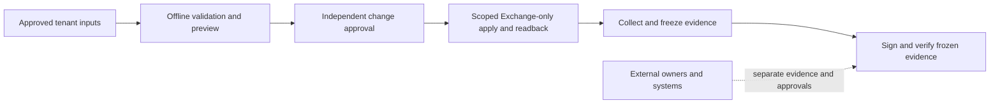

# Enterprise-scale Exchange Online

This repository contains an evidence-oriented Exchange Online security baseline and its administrator workflows. The supported sample is [`samples/contoso-exchange-online-managed-service`](samples/contoso-exchange-online-managed-service/); it focuses on Exchange Online, Exchange Online Protection, and Microsoft Defender for Office 365. It is not an official Microsoft product and does not provision a tenant or certify overall security readiness.

## Get started

1. Read the [Exchange administrator journey](samples/contoso-exchange-online-managed-service/docs/EXCHANGE-ADMINISTRATOR-JOURNEY.md) for prerequisites, external owner approvals, and the ordered procedure.
2. Review the [Exchange-only execution boundary](samples/contoso-exchange-online-managed-service/docs/EXCHANGE-ONLY.md), [approved change and rollback](samples/contoso-exchange-online-managed-service/docs/APPROVED-CHANGE.md), and [frozen evidence gate](samples/contoso-exchange-online-managed-service/docs/EXCHANGE-GO-LIVE.md).
3. Run the offline journey test from the sample directory with PowerShell 7.5+ and Pester installed:

   ```powershell
   Set-Location samples/contoso-exchange-online-managed-service
   Invoke-Pester -Path ./tests/unit/ExchangeAdministratorJourney.Tests.ps1 -Output Detailed
   ```

4. For an actual tenant, use a protected, change-controlled parameter file outside the repository. The checked-in sample inputs are synthetic and intentionally incomplete; follow the documented approvals and preview gates before any authorized changes.

The public scripts default to the versioned **Exchange-only** profile. Historical Microsoft-native and third-party gateway profiles are not the active workflow; historical execution requires explicit opt-in. The deprecated custom-policy implementation under [`deprecated`](deprecated/) is not supported and must not be used to deploy a baseline.

## Where to go next

| Need | Start here |
| --- | --- |
| Understand repository scope and control coverage | [Solution summary](SOLUTION_SUMMARY.md) |
| Follow the supported onboarding procedure | [Exchange administrator journey](samples/contoso-exchange-online-managed-service/docs/EXCHANGE-ADMINISTRATOR-JOURNEY.md) |
| Review control definitions and manual ownership | [Control catalog](samples/contoso-exchange-online-managed-service/docs/CONTROL-CATALOG.md) |
| Find per-control procedures and verification | [Runbooks](samples/contoso-exchange-online-managed-service/docs/RUNBOOKS.md) |
| Understand rejected historical implementation | [Deprecated material](deprecated/README.md) |

## Repository layout

```text
samples/contoso-exchange-online-managed-service/
  config/     Versioned Exchange-only profile, schema, and synthetic input templates
  scripts/    Preview, approved deployment, and evidence collection
  tests/      Offline Pester tests and guardrails
  docs/       Onboarding, change approval, evidence, controls, and runbooks
  dashboard/  Local evidence viewer
deprecated/   Quarantined historical implementation; not a deployment path
SOLUTION_SUMMARY.md
```

The dashboard is a local viewer, not an approval or readiness authority. Its baseline preview and any example values are illustrative only; use the signed, frozen evidence workflow for the supported admission decision.

## Supported workflow



The workflow does not provision tenant prerequisites or turn externally owned controls into Exchange-verified results.
